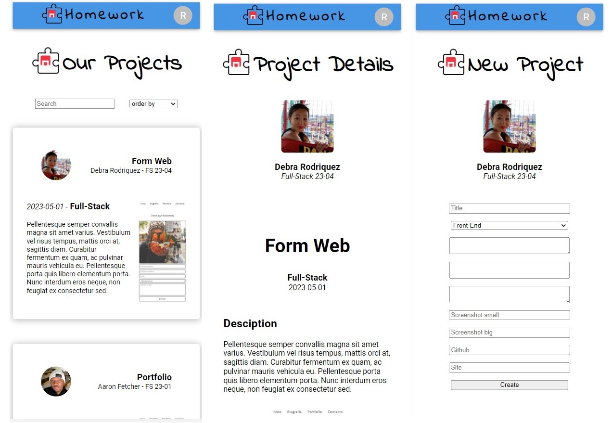
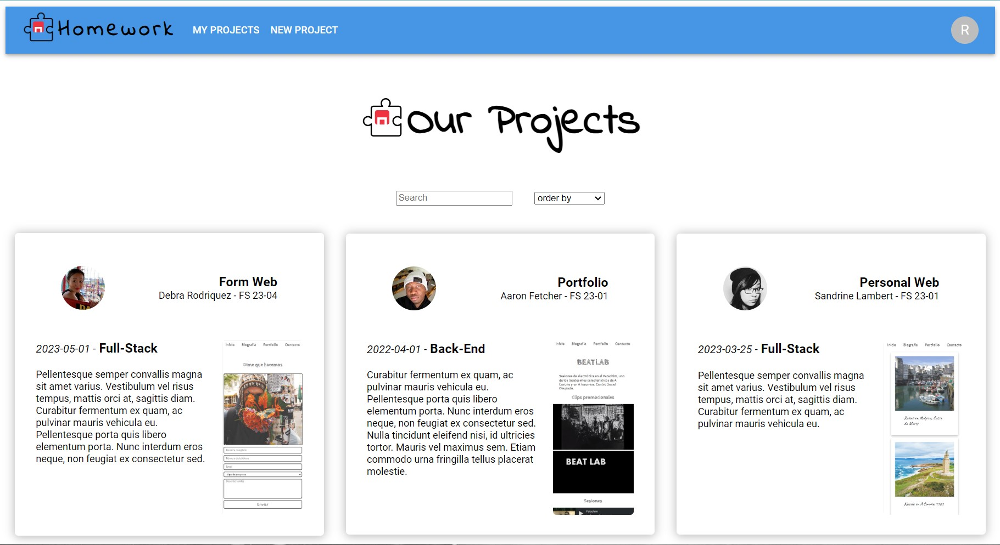

# Homework

A place where the students of The Bridge can upload share their projects.

## Table of contents

- [Guide](#guide)
  - [Prerequisites](#prerequisites)
  - [Installation](#installation)
  - [Usage](#usage)
- [Overview](#overview)
  - [The challenge](#the-challenge)
  - [Screenshot](#screenshot)
  - [Links](#links)
- [My process](#my-process)
  - [Built with](#built-with)
  - [What I learned](#what-i-learned)
  - [Continued development](#continued-development)
  - [Useful resources](#useful-resources)
- [Author](#author)
- [Acknowledgments](#acknowledgments)

## Guide

### Prerequisites

You need to install npm. To install the latest version:

- npm
  ```sh
  npm install npm@latest -g
  ```

### Installation

1. Clone the repo
   ```sh
   git clone https://github.com/Radu-A/homework
   ```
2. Install NPM packages on the root directory
   ```sh
   npm install
   ```
3. Install NPM packages on "client" directory
   ```js
   npm install
   ```
3. Run the node server on the root directory
   ```js
   npm start
   ```
3. Run react aplication on "client" directory
   ```js
   npm start
   ```

### Usage

- Home: You can search and navigate throw the projects. If you click on the name of a directory you can see his details
- Sign in / Log in: Try to sign in usign your github account.
- My Projects: The place to create new projects or delete the old ones.

## Overview

### The challenge

Develop an entire web aplication with PostgreSQL, Node and React

Phase 1 
- A board with all the projects
- A detail view of the projects
- A user section to create or delete projects
- A sign up form where you can link some data from your github account
- A log in view

Phase 2
- Real authentication with Github
- Posibility to vote projects

### Screenshot




### Links

- Solution URL: (https://github.com/Radu-A/homework)

## My process

### Built with

- PostgreSQL and Render
- Node Express
- Semantic HTML5 markup
- SASS custom properties
- Flexbox
- Mobile-first workflow
- [React](https://reactjs.org/) - JS library
- [Material UI](https://mui.com/) - For styles

### Key points

Back-end
- Data model design with Entity-Relationship Diagram
- Create and deploy a PostgreSQL Data Base
- Construct the CRUD with Node and PostgreSQL
- Routing with Node and Express
- Reset the value of the input after the search
Front-end
- Build the React components structure
- Functionality with React states and lifecycle of their components
- Implement Hooks to enlarge the potential of the App
- Routing with React Router Dom
- Styles with SASS
- MUI components

### Continued development

- Authentication
- Concurrently
- Deploy

### Useful resources

- [React documentation](https://es.react.dev/learn) - This is an amazing documentation that guides you to get used with the way that React works.
- [react-hook-form documentation](https://react-hook-form.com/get-started) - This documentation is also great and show you step by step how to implement this hook to your project.

## Acknowledgments

Thanks a million to my teacher Alejandro Reyes and his teacher assistances Guillermo Rubio and Javier Espinosa. I can do all this stuff because of them.
